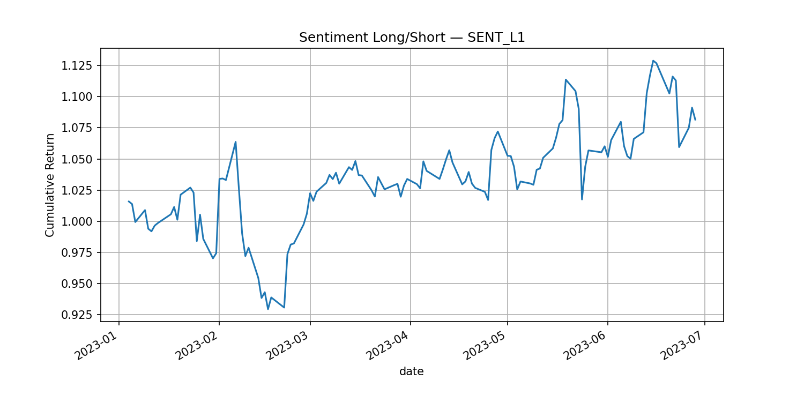

# 📈 Strategy Simulator

Backtest and evaluate sentiment-driven equity factors.
Connect **NLP-derived sentiment signals** to **portfolio performance** with reproducible, configurable pipelines.

---


> Backtesting engine that connects NLP sentiment signals to equity factor performance with reproducible, config-driven pipelines.


## 🚀 Why This Exists

| Problem | Impact |
|---------|--------|
| Raw sentiment scores lack financial validation | Signals may be anecdotal or overfit |
| Ad-hoc notebooks | Hard to reproduce / audit |
| No structured factor pipeline | Difficult to extend with new alpha hypotheses |
| Opaque methodology | Stakeholder skepticism |

---

## 🧠 Core Concepts

| Concept | Description |
|---------|-------------|
| Sentiment Panel | Daily ticker-level sentiment features (parquet) |
| Factors | Derived transformations (lags, shocks, breadth) |
| Forward Returns | Close-to-close % move aligned to today’s signal predicting tomorrow |
| Portfolio | Long top N%, short bottom N% based on a factor |
| Metrics | Sharpe, Max Drawdown, IC, Turnover, Rolling IC |

---

## 🏗 Architecture (High-Level)

```
Sentiment Parquet --> Factor Builder --> Joined Panel --> Ranking Engine
                                |                             |
                             (cache)                     Portfolio Simulator
                                                              |
                                                        Metrics & Reports
```

See [docs/architecture.md](docs/architecture.md) for a full diagram.

---

## ✨ Features

- Load parquet sentiment + price data
- Compute baseline factors: SENT_L1 (lag), SENT_SHOCK (surprise)
- Rank & build long/short portfolios
- Evaluate IC, Sharpe, Max Drawdown
- Export equity curve & metrics
- Configuration-driven runs (`configs/backtest.default.yaml`)
- (Roadmap) Sector neutrality, multi-factor blending, transaction costs

---

## 🏁 Quickstart

```bash
# 1. Install (dev mode)
pip install -e .[dev]

# 2. (Optional) Install pre-commit
pre-commit install

# 3. Run baseline backtest
python run_test.py

# 4. View results
ls reports/
```

---

## 📂 Project Layout

```
strategy_simulator/        Package code
configs/             YAML config files
scripts/             CLI entry points
data/                (gitignored) sentiment & prices
reports/             Generated artifacts (equity curve, metrics)
docs/                Extended documentation
tests/               Unit tests
```

---

## 📊 Data Requirements

See [docs/data_schema.md](docs/data_schema.md). Minimal sentiment panel columns:

| Column | Type | Example | Notes |
|--------|------|---------|------|
| date | date/datetime | 2024-05-01 | UTC normalized |
| ticker | string | AAPL | Uppercase |
| sentiment | float | 0.34 | Raw daily score |
| source_count | int | 12 | (optional) signal reliability |

---

## Example (Programmatic)

```python
from strategy_simulator.config import load_config
from strategy_simulator.pipeline import run_strategy

cfg = load_config("configs/backtest.default.yaml")
strategy, metrics, fig = run_strategy(cfg)
print(metrics)
# fig.savefig("reports/equity_curve_SENT_L1.png", dpi=150, bbox_inches="tight")
```
---

## 🧬 Factor Definitions

Full list in [docs/factor_definitions.md](docs/factor_definitions.md).

| Factor | Description | Logic |
|--------|-------------|-------|
| SENT_L1 | Lagged sentiment | groupby(ticker).shift(1) |
| SENT_SHOCK | Deviation from rolling mean | sentiment - rolling_mean_5 |

---

## 📈 Sample Output

| Metric | Value (example) |
|--------|-----------------|
| Sharpe | 1.12 |
| Max Drawdown | -0.18 |
| IC (mean) | 0.045 |

sample report: 


---

## 🛠 Configuration

Edit `configs/backtest.default.yaml`:

```yaml
factor:
  name: SENT_L1
portfolio:
  long_percentile: 0.2
  short_percentile: 0.2
```

Override via CLI:
```bash
python scripts/run_backtest.py --config configs/backtest.default.yaml --factor SENT_SHOCK
```

---

## 🔍 Methodology

Transparent details in [docs/methodology.md](docs/methodology.md):

- Forward returns alignment
- Ranking percentile logic
- Equal-weight construction
- No transaction costs (baseline)
- Daily rebalancing
- IC computation (Spearman)

---

## 🛤 Roadmap (Excerpt)

- Sector / beta neutrality
- Turnover constraints
- Cost & slippage modeling
- Multi-factor composite
- Capacity analysis
- Rolling decay plots
- ML blending of factors

---

## 🤝 Contributing

See [CONTRIBUTING.md](CONTRIBUTING.md).
1. Fork + branch
2. `make init-dev`
3. Add tests for new features
4. Ensure `make ci` passes

---

## 📜 License

MIT (add LICENSE file if not present).

---

## 🙋 FAQ

See [docs/faq.md](docs/faq.md).

---

## 🧾 Changelog

Maintained in [CHANGELOG.md](CHANGELOG.md) (Keepers: please update per release).

---

## 🧪 Testing

```bash
pytest -q
```

---

## 🧱 Design Principles

| Principle | Rationale |
|-----------|-----------|
| Determinism | Reproducible factor quality |
| Explicitness | Avoid hidden defaults |
| Extensibility | Easy to add new factors |
| Separation | Isolate metrics/factors/data loads |

---

## 📮 Support / Questions

Open an Issue or start Discussion (future).
Feel something is unclear? Propose a doc improvement in PR.

---
