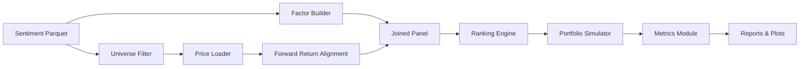

# Architecture

## Overview
The strategy simulator transforms daily sentiment data into investable factor evaluations and portfolio performance metrics.

## Data Flow

## Components

| Module | Responsibility |
|--------|----------------|
| datasets.py | Loading sentiment & price data |
| factors.py | Factor construction & transformations |
| backtest.py | Portfolio construction & daily PnL |
| metrics.py | Sharpe, Drawdown, IC, turnover |
| plots.py | Equity curve & (future) rolling IC |

## Design Choices

- **Stateless Functions**: Encourages testability.
- **Config-Driven**: Avoids magic constants for experiments.
- **Modularization**: Factor and metrics modules isolated for extension.

## Extensibility Pattern

Add a new factor:
1. Implement function in `factors.py`.
2. Register it in `compute_factors`.
3. Reference its name in config `factor.name`.

## Future

- Plugin registry for dynamic factor discovery
- Persistence layer for intermediate standardized datasets
